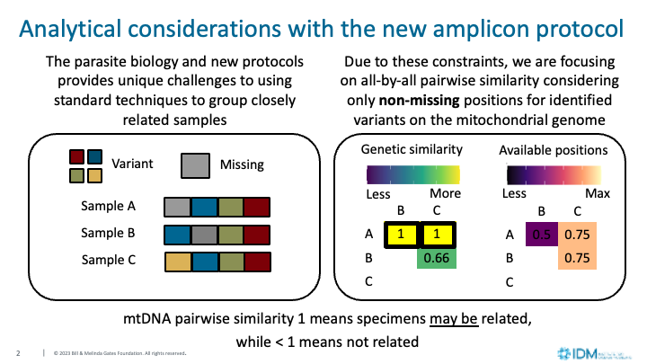

# mtDNA Analyses Files

This folder contains scripts for mtDNA analyses and visualizations. The libraries required to run the analysis file is not included in the conda environments for processing (Snakemake pipeline) or NextStrain visualization, however the Nextstrain environment does have a majority of the required packages. All necessary packages should download and load automatically however user experience may vary. We recommend for users to run the pipeline manually to confirm the necessary packages download and load correctly before using the command line version of the script. 

Outputs from module_mtDNAAnalyses.R can be input into the NextStrain visualization tool, found in the parent directory.

Necessary files:
- Diploid VCF: Diploid VCF generated from the Guinea worm NGS tiling amplicon panel processing pipeline.
- Metadata: Metadata for the sequenced samples in the VCF file. Minimum fields include sampleID (Vassar generated), country, year, and host for standard analyses.

See the other optional command line options for filtering with the command:

```
module_mtDNAAnalyses.R --help
```


Country specific analysis examples have been automated for recurring analyses, but can be further expanded for bespoke analyses. Country specific analyses require running the mtDNA analysis module for necessary inputs.

```
module_countryAnalyses.R --help
```


## Output Files 

### Text files for flexible analyses
**GenomicSamplesMetadata_Database_{batch_name}.tsv**

Assumed the suffix used by the Genomics Working Group for metadata base name, but any metadata name file will receive a {batch_name} appendix. The script runs minor formatting checks on a few columns including host, GPS coordinates, and emergence date. The following additional columns are added.

* missing_n_{n_variants}: The number of variant positions within barcode that are missing. The length of the barcode, n_variants, can vary by sequencing batch.  
* analysis_inclusion: Whether the sample is eligible for inclusion in analyses based on the proportion of missing barcode positions. Default threshold of position missingness set to 10% of the barcode.    
* sequence: Barcode for each sample created from high quality variant positions.         
* group: Random numerical assignment for unique barcodes in order of appearance in the VCF. 
* amplicon_barcode_conservative: Same as group, but ordered by the frequency, i.e. the most frequent barcode is now 1.   
* frequency_conservative: The count for each group in the total dataset of available sequences.   
* amplicon_barcode: A numerical assignment for group after manually clustering barcodes with <10% of missing positions to more common barcode if and only if they are uniquely identical to one common barcode at available variant positions.        
* amplicon: Same as amplicon barcode for common barcodes, but groupings for less commonly observed barcodes for visualization ease. Generally, groupings for less frequent barcodes are observed <10, observed once, and the same for lower confidence barcodes in the total dataset.
* frequency: The count for each amplicon_barcode in the total dataset of available sequences.      
* gps_id: Dummy variable to identify unique latitude and longitude combinations for faster indexing. 


**{batch_name}_jointHaploidFilterWithSingletons.vcf.gz**

VCF file with high quality variants and samples created from user defined parameters. The reduction in samples and variants from the parameters are summarized in **{batch_name}_filterSummary.tsv**. Includes high quality variants that are found in only one sample. 


**{batch_name}_filterSummary.tsv**

Summary of **{batch_name}_jointHaploidFilterWithSingeltons.vcf.gz** properties, including the  number of samples, variants, and filtering parameters. 


**{batch_name}_BarcodeVariantSummary.tsv**

Summary from  **{batch_name}_jointHaploidFilterWithSingeltons.vcf.gz** containing the variant positions, reference, and alternative allele descriptions for high-quality variants included in the barcode. 


**{batch_name}_relatednessBarcodes.txt**

Long format of all unique pairwise comparisons of barcodes identified in the entire sequencing library. Note, to reduce file size only the lower matrix of pairwise comparisons is saved. This file can be cross-referenced with the updated metadata file that contains the amplicon barcode designation for each sample for smaller pairwise comparisons (see {batch_name}_CountryPairwiseLists.rds for more information about other readily available data formats for this purpose). 

- sequence.x: The barcode sequence for the first barcode in the pair. 
- sequence.y: The barcode sequence for the second barcode in the pair.
- all: The dissimilarity of two sequences with all positions from the barcode created of high quality variants. 
- rmNA: The dissimilarity of two sequences, excluding the missing positions for either sequence in the pair from the barcode created of high quality variants.  
- missing: The proportion of missing positions within a pair of sequences for interpretation of the rmNA parameter. 
- amplicon_barcode.x: A dummy number assigned to the individual sequences for sequence.x, matches the amplicon_barcode number in the updated metadata file for each sequenced specimen.
- amplicon_barcode.y: A dummy number assigned to the individual sequences for sequence.y, matches the amplicon_barcode number in the updated metadata file for each sequenced specimen.
- amplicon_barcode_pair: A concatenated string of the sorted amplicon_barcode.x and amplicon_barcode.y numbers for easier indexing and/or merging with specimen pairwise analyses. 


**{batch_name}_CountryPairwiseLists.rds**

R list object containing the long format of specimen pairwise comparisons by country. By default to improve efficiency and reduce file size, pairwise comparisons are computed for all specimens within an emergence year and between specimens from the previous year. 

- gps_id_pair: Merging column for all unique pairwise calculations of Haversine distances in the metadata file for the specific worm pair 
- sample.x: Vassar assigned labID for the first sample in the pairwise comparison 
- sample.y: Vassar assigned labID for the second sample in the pairwise comparison 
- amplicon_barcode_pair: A concatenated string of the sorted amplicon_barcode.x and amplicon_barcode.y numbers for easier indexing and/or merging with specimen pairwise analyses. 
- year_pair: Case year of both specimens if from the same years, "Mixed" if across years.
- host_pair: Infected host species of both specimens were in the same host, "Mixed" if two different host species.
- emergence_date_pairs: The difference in days between the emergence date of both specimens if provided.
- generation: "Within 10-14 mo" to specify both specimens in the pair could potentially be in subsequent generations based on the prepatent period, "Unlikely or unknown" if the specimens in the pair are not within the prepatent period or the emergence date for at least one of the specimens is unknown. 
- all: The dissimilarity of two sequences with all positions from the barcode created of high quality variants. 
- rmNA: The dissimilarity of two sequences, excluding the missing positions for either sequence in the pair from the barcode created of high quality variants.  
- missing: The proportion of missing positions within a pair of sequences for interpretation of the rmNA parameter. 
- meters: The haversine distance between both specimens based on GPS coordinated provided in the metadata file. 


**{batch_name}_CountryBarcodeOverlapCounts.tsv**

A list of amplicon barcodes that are shared between countries within a year for further investigation of putative links between cases. Includes the number of specimen samples from each country that share that amplicon. 


**{batch_name}_CountryBarcodeOverlapSpecimens.tsv**

Long format of **{batch_name}_CountryBarcodeOverlapCounts.tsv** specifically including which samples by Vassar LabID are included for each amplicon barcode by year. The kinship_consideration_group is a dummy grouping variable for potentially automating kinship analyses from microsatellite data.  


### Plots from mtDNA analyses

All plots from the script are automatically assigned a date (Y/M/D) of creation as a prefix. Wildcards of country below can also be replaced by specific groupings, such as user defined foci, villages, or epidemiological relevant cases. Flexibility to generate plots with more distinct groupings for the types of plots created is easily achieved since the plotting code is flexible to specify samples of interest. 

- {sequencing_batch}_BarcodeClusteringChanges.png: Bar plots showing the changes to the number of total barcodes, and quantification of the confidence groupings pre and post manual clustering per specimen and barcodes. 

- {country}_{month/year}_barcodeCounts.png: A bar plot of barcodes found in a country at either a yearly or monthly scale, from the 'amplicon' column of the updated metadata. Barcode colors are consistent throughout country plots, and may require updating for instances where 80+ unique barcodes after groupings may exist. Specimens without an emergence date provided in the metadata will be dropped from the monthly representation of specimen counts. 

- {country}_year_barcodeProportion.png: A two panel bar plot of barcodes found in each country, but scaled by proportion per year. Accompanied by a plot of the number of specimens sequences per year colored by the infection host. 

- relatednessDensity.png: A multipanel plot showing the smoothed density plot of pairwise relatedness within countries and the cumulative density plot of pairwise relatedness within countries. Country inclusion varies by specimen counts (> 5 specimens) and includes all pairwise comparisons of specimens within the same and previous year.


## Plots from country-specific analyses

- {country}_pariwiseHexByDist.png: A scatter plot of genetic similarity and distance to broadly observe the relationship between there two variables. To limit plotting time and output file size, the frequency of points is reduced into a heatmap of hexagons. 

- {country}_simDist.png: Similar to pairwiseHexByDist, but shows pairs as points as colors by same or +/- 1 year. Accompanied by plot panels with sample counts that successfully sequenced and counts by infection host. 

- {country}_pairwiseHeatmap.png: An alternative visualization for pairwise similarity distributions by bins of relatedness. It highlights the proportion of pairwise samples in each relatedness bin per years, with the total number of pairwise comparisons as text for between year comparison of trends. 

- cluster_{country/group}.png: Pairwise related matrices (upper matrix) and variant position availability for confidence (lower matrix). Accompanied by a plot of the number of specimens sequences per year colored by the infection host and the barcode grouping that would match the accompanying Nextstrain visualization. 



- {assigned_name}_PairwiseDistributions.png: Smoothed density plot of pairwise relatedness by user defined subsets such as host, different admin groupings, etc. 

## Versions
* 02/2025
    
    - Split the mtDNA processing and barcode comparisons from the country specific analyses into two files. 

    - The inclusion of high-quality singleton variants from a small number of samples included in the global barcode.  

    - Manual clustering of barcodes with < 10% of missing positions in the barcode to commonly observed barcode groups. Barcodes with missing positions are only clustered to a barcode group that is complete if and only if when comparing available positions to all complete barcodes returns a single potential match. Barcodes with missing variant calls in their barcode are considered high quality (<= 1% of positions missing), medium quality (<= 2% of positions missing), and lower quality (< 10% of positions missing). Summary statistics prior to and after manual clustering are provided for each quality bin. Barcodes >= 10% missing positions are excluded from barcode clustering and subsequent analyses by default, but this threshold an be adjusted by the user for further testing if desired.  

    - To improve memory needs and run time, code has been optimized from all-by-all sequence comparisons to unique barcode comparisons. This has resulted in a new output file that has all-by-all similarity of all positions and available positions for each barcode identified in the sequence batch, which can be referenced with the amplicon_barcode_conservative column in the updated metadata file. Additionally, the relatedness of samples within a country in the same year (potential siblings) and the prior year (potential parents) is also provided by default. Relatedness between other pairs of worm specimens, such as cross-border comparisons, are not included by default. The files from running the module_mtDNAAnalyses.R file will contain all the information to extract information about bespoke comparisons. 

    - Nextstrain use has ben deprecated. Files from the analysis steps could still be used to create Nextstrain input.

* 07/2024: First version of documentation for output files added. 

* 04/2024: Added VCF processing that was previously part of the NextStrain instance to the analysis file. This includes creating a haploid genotype from the diploid VCF (to catch heteroplasmy or nuclear gene duplicates), filtering variant positions based on sample quality, and filtering samples with lower sequence quality at variant positions. It also organizes several iterations of analysis code and visualization into a single script. Metadata checks are only subject to previously known inconsistencies with data (ie multiple formats for GPS), more may be needed in the future. 