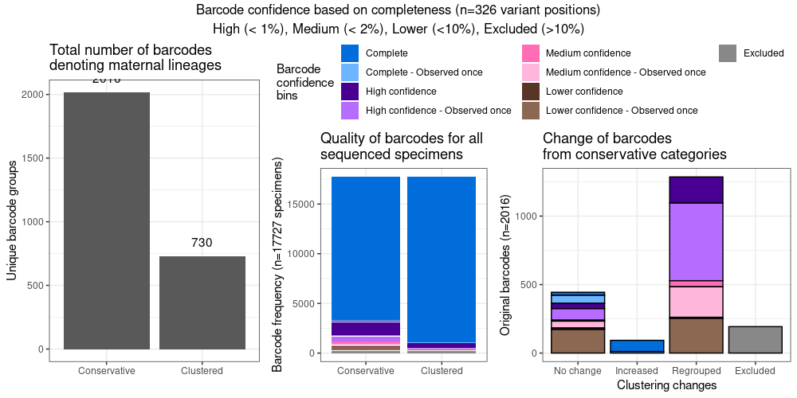

# *Dracunculus medinensis* mitochondrial amplicon analysis methods

Author: Jessica Ribado (jessica.ribado@gatesfoundation.org)

Date: 05/2025

## Generating barcode groups indicative of maternal lineages

### Filtering variants to a high-quality library wide representative set 

High-quality SNP variants generated by GATK were further processed to construct mitochondrial barcode strings for grouping specimens into maternal lineages using the vcfR package in R [Knaus and Grünwald 2017]. Diploid variant calls were converted to a haploid representation with positions with heterozygous calls or with fewer than 10 reads were recoded as missing. Samples with more than 50% missing variant positions after this recoding step were excluded from further analysis. Variant sites were retained if more than 70% of samples within a sequencing library had non-missing data at that position. To increase sensitivity for identifying maternal lineages, low-frequency variants, including high-quality singletons, were retained. The number of samples and variant sites before and after filtering are provided in Table S2. All mitochondrial barcode processing steps were implemented in R, and the code is publicly available at: https://github.com/InstituteforDiseaseModeling/GWSpatialGenetics/analyses/module_mtDNAAnalyses.R.

[Table S2 - Statistics for the library as of April 24, 2025]

| Description                                     | Value  |
|-------------------------------------------------|--------|
| Samples (All)                                   | 18016  |
| Samples (Excluding technical replicates)        | 17799  |
| Variants                                        | 1740   |
| Minimum genotype ready depth                    | 5      |
| Heterozygous recode proportion                  | 0,1    |
| Maximum proportion of samples missing a call    | 0.7    |
| Maximum proportion of missing sites per sample  | 0.5    |
| Samples after filtering                         | 17717  |
| Variants after filtering                        | 326    |
| Variants after filtering, singletons excluded   | 249    |

### Barcode relatedness and clustering

Given the hypothesized low mitochondrial mutation rate in D. medinensis based on comparative data from other nematode species, a single high-confidence base pair difference is considered sufficient to distinguish maternal lineages. To conservatively estimate the number of extant lineages, consistent with prior evidence of a historically large and genetically diverse population [Thiele et al 2018], lineages were initially defined based on the exact match of barcode strings. This approach assumes that any missing base in a barcode could potentially harbor a lineage-informative variant. However, variability in sequencing quality due to sample condition and spurious differential amplification efficiency across amplicons can artificially inflate lineage counts under this assumption. To address this, a hybrid approach was employed. Incomplete barcodes with fewer than 10% missing positions were manually reassigned to a known complete barcode if and only if they exhibited 100% identity across the available (non-missing) positions to a single complete barcode. These reassigned barcodes allow for robust tracking of maternal lineages across spatial and temporal scales. For direct comparisons between specimens, the all-by-all pairwise Hamming distances between unique barcode strings were computed, considering both missing and non-missing positions. The proportion of missing data in each pairwise comparison was also recorded to contextualize relatedness and data completeness. The impact of barcode completeness on lineage assignment is summarized in Figure 1, which stratifies barcode strings by confidence bins: Complete (0% missing), High (<1% missing), Medium (<2% missing), Lower (2–10% missing), and Excluded (>10% missing).

## Additional resources and notes 

* Filtering the GATK variants for analyses will vary by sequencing batch, the table above can vary significantly based on the thresholds set for retaining variants based on the library size. 

* Thresholds for site inclusion for the barcode, confidence bins for reassignment, and exclusion are a suggestion but more variation in barcodes can be achieved by lowering or raising each. The thresholds now are meant to balance the full library, but country specific

## References
Knaus, B.J. and Grünwald, N.J. (2017). vcfr: a package to manipulate and visualize variant call format data in R. Molecular Ecology Resources, 17(1), 44–53. https://doi.org/10.1111/1755-0998.12549

Thiele EA, Eberhard ML, Cotton JA, Durrant C, Berg J, Hamm K, et al. Population genetic analysis of Chadian Guinea worms reveals that human and non-human hosts share common parasite populations. PLOS Neglected Tropical Diseases. 2018;12(10):e0006747. pmid:30286084